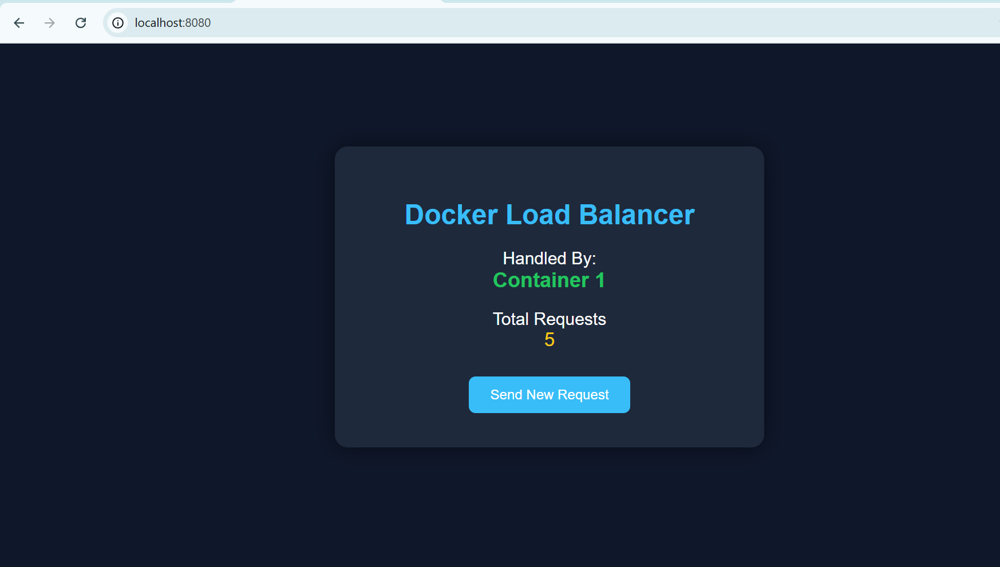

# 🚀 Docker Load Balancer Web Application

A containerized Flask web application demonstrating **load balancing using Nginx and Docker Compose**.

This project shows how multiple application containers can handle user traffic through a load balancer, simulating a **real-world scalable architecture** used in modern cloud systems.

---

# 📌 Project Features

✔ Flask web application
✔ Docker containerization
✔ Load balancing using Nginx
✔ Multiple container instances
✔ Simple UI dashboard
✔ Request counter monitoring
✔ Container orchestration using Docker Compose

---

# 🧱 Project Architecture

User Request

⬇

Nginx Load Balancer

⬇

Flask Container 1
Flask Container 2

Each refresh distributes requests between containers.

---

# ⚙️ Technologies Used

* Python (Flask)
* Docker
* Nginx
* Docker Compose
* HTML / CSS

---

# 📂 Project Structure

docker-loadbalancer-project

│
├── app.py
├── Dockerfile
├── docker-compose.yml
├── nginx.conf
├── requirements.txt
│
└── templates
  └── index.html

---

# ▶️ How to Run the Project

### 1️⃣ Clone the repository

git clone https://github.com/yourusername/docker-loadbalancer-project.git

### 2️⃣ Navigate into the project folder

cd docker-loadbalancer-project

### 3️⃣ Build and run containers

docker-compose up --build

### 4️⃣ Open in browser

http://localhost:8080

---

# 📊 Application Dashboard

The UI displays:

* Container handling the request
* Total number of requests processed
* Button to send new request

Refreshing the page will show requests handled by different containers, demonstrating **load balancing**.

---

# 🎯 Learning Outcomes

This project demonstrates:

* Containerized application deployment
* Load balancing architecture
* Microservice style scaling
* Docker orchestration using Docker Compose
* Basic DevOps workflow

---

Developed a containerized Flask web application deployed using Docker and orchestrated with Docker Compose. Implemented Nginx as a load balancer to distribute traffic between multiple containers and designed a UI dashboard to visualize request handling and container responses.

---

# 📸 Demo

Open browser:

http://localhost:8080

Refresh the page to observe load balancing between containers.

---

# ⭐ Future Improvements

* Auto scaling containers
* Kubernetes deployment
* Real-time monitoring dashboard
* Cloud deployment (AWS / GCP)

## Project Demo

---

# 👨‍💻 Author

Santhosh S
